<p align="center">
  
</p>
<h1 align="center">MkDocs Material Linter</h1>
<p align="center">A VS Code extension tailored for MkDocs Material</p>

## Features:
- Flags common syntax mistakes in the Problems panel
- Adds clearer visual cues for blocks, tables, and inline features
- Ships with built‑in light/dark themes for best results

## 1. Who It’s For

If you write MkDocs Material docs (admonitions, content tabs, tables, task lists, etc.), this helps you catch issues early and keep docs readable.

## 2. Best Practices 
1) Heading styles  
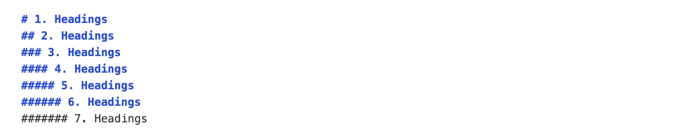

2) Admonition highlight  
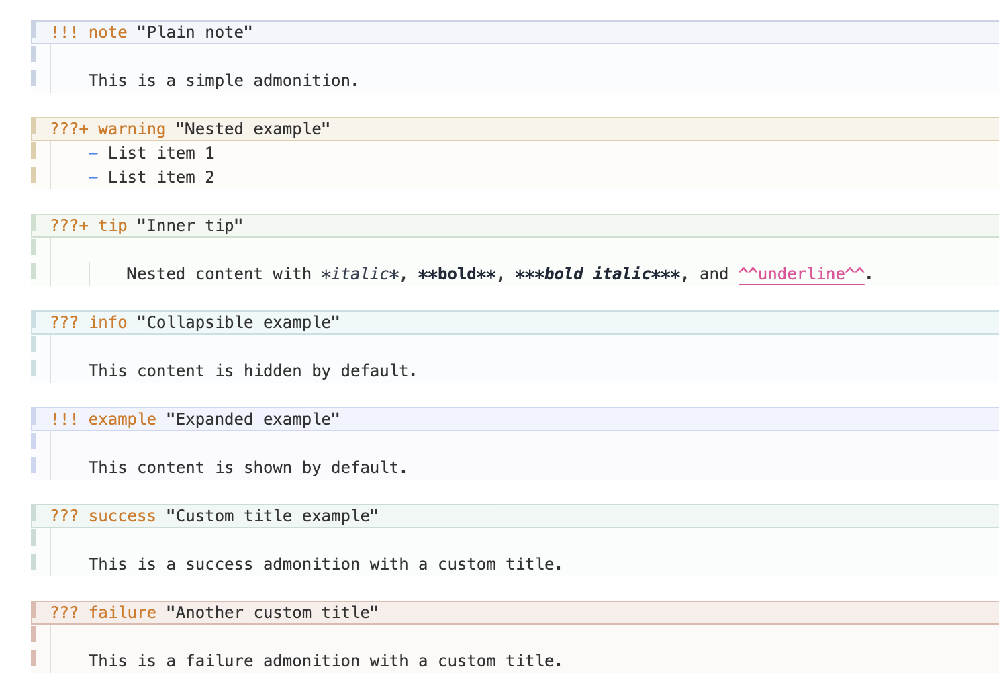

3) Nested admonition bars  


4) Tables (border + header)  
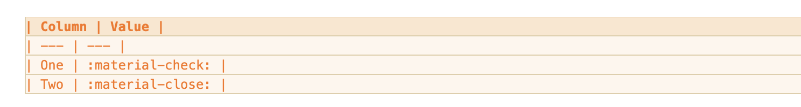

5) Tabs syntax  


6) Diagnostics in Problems panel  


7) Math blocks  
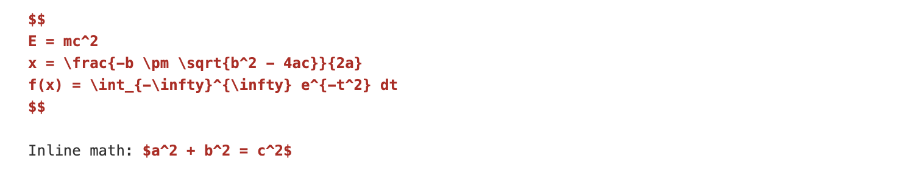

8) Blockquotes  
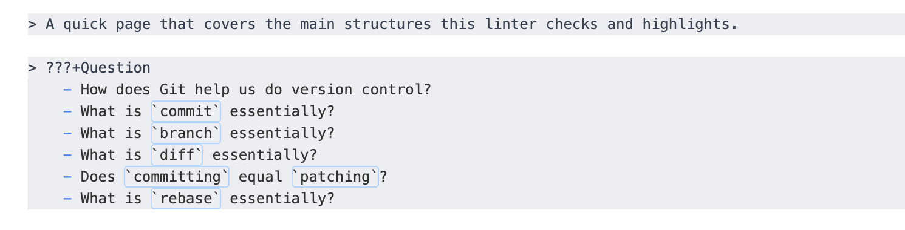

9) Code blocks  
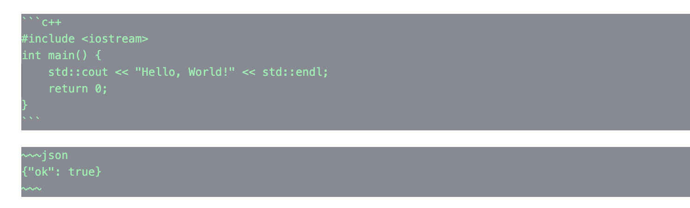

10) Front matter (`---`)  
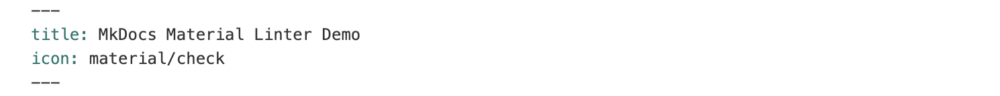

11) Images  
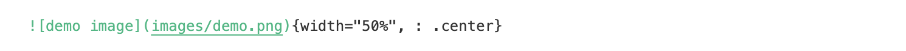

12) Icons & emojis  


13) Footnotes & tooltips  
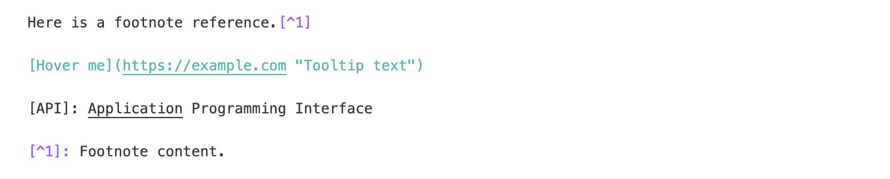

## 3. Themes

Two built-in themes are provided for best highlighting:
- `MkDocs Material Linter (Light)`
  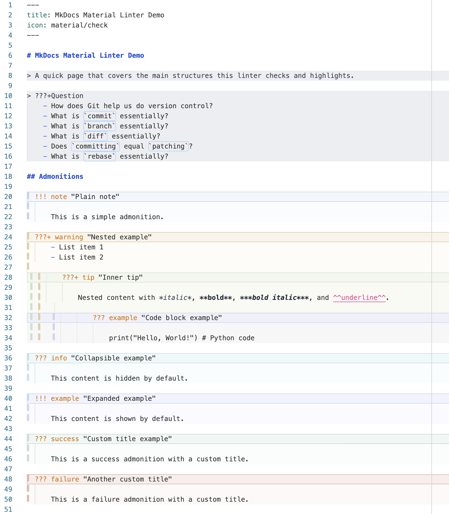
- `MkDocs Material Linter (Dark)`
  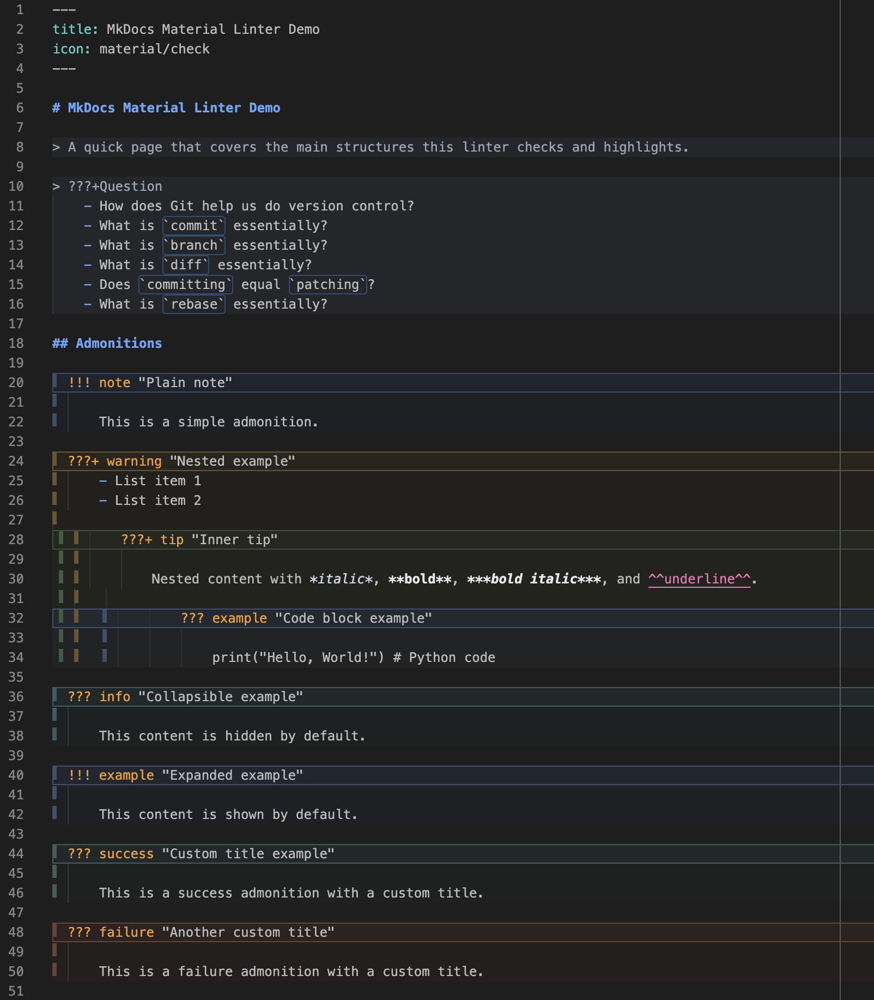

`VS Code` → `Preferences` → `Color Theme` → `select one of the above`.  
You can also use diagnostics without switching themes.

## 4. Theory about What It Does

We highly recommend using the provided themes to get the full benefit of the extension, but diagnostics will work regardless of theme.

### 4.1 Diagnostics (Errors/Warnings)
| Area | Rule | Example |
| --- | --- | --- |
| Admonition | marker must have a type | `!!! note`, `???+ question` |
| Admonition | type must be a simple identifier | letters/numbers/`_`/`-` |
| Admonition | unknown type → warning | `!!! foo` |
| Admonition | title quotes must close | `!!! note "Title"` |
| Admonition | content must be indented | 4 spaces or 1 tab |
| Admonition | blank line before non‑list content | list can follow immediately |
| Tabs | must be `=== "Title"` or `=== 'Title'` | quotes required |
| Tabs | content must be indented | 4 spaces or 1 tab |
| Lists | marker must be followed by a space | `- item`, `1. item` |
| Lists | blank line before a list in normal text | avoids `-item` look |
| Tables | header must be followed by separator | `| --- |` |
| Tables | separator column count must match header | consistent columns |
| Code blocks | fence must be closed | ``` / ~~~ |
| Math | `$$` blocks must be closed | `$$ ... $$` |

### 4.2 Visual Cues
- Admonitions: narrow color bars + subtle background (nested blocks show multiple bars)
- Tables: soft background + stronger header + outer border + row separators
- Headings, blockquotes, icons/emojis, math, footnotes, etc. are more distinct
- Code blocks: dark background with light text for readability

## 5. Supported Files

- Markdown (`.md`)
- MDX (`.mdx`)

## 6. Configuration

You can customize the linter behavior in VS Code settings:

| Setting | Default | Description |
| --- | --- | --- |
| `checkBlankLineBeforeList` | `true` | Require blank line before lists in normal text |
| `checkBlankLineBeforeAdmonitionContent` | `false` | Require blank line before admonition content (except lists) |
| `checkIndentation` | `true` | Check indentation for admonitions and tabs |

**Example** (`settings.json`):
```json
{
  "mkdocs-material-linter.checkBlankLineBeforeList": true,
  "mkdocs-material-linter.checkBlankLineBeforeAdmonitionContent": false,
  "mkdocs-material-linter.checkIndentation": true
}
```

## 7. Additional Shortcuts

VS Code doesn't have built-in shortcuts for some of the rich text format shortcuts MkDocs Material supports. Here are some useful ones:

- Underline (MkDocs `^^underline^^`): `Ctrl+U` / `Cmd+U`

## 8. Quick Diagnose

## 8.1 Correct
```md
!!! note "Title"
    This is valid.

???+ question "FAQ"
    - First item
    - Second item

=== "Tab A"
    Tab content.

| Method | Description |
| --- | --- |
| GET | Fetch |
```

### 8.2 Common Mistakes
```md
!!!note
Text not indented.

=== Tab A
    Missing quotes.

-item
1.item
```
